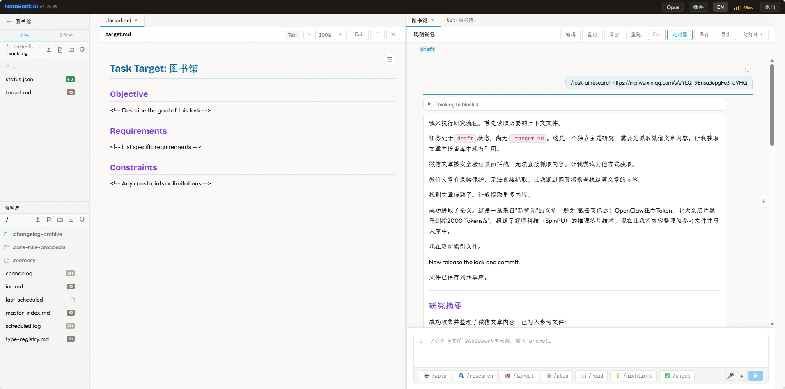

# Notebook AI

An AI-powered notebook workspace — like Jupyter Notebook, but backed by Claude or Gemini as the execution engine.



```
┌──────────────── Toolbar (model selector, connection status) ─────────────────┐
├─ Sidebar (272px) ─┬─ Main Content ──────────────────────────┬─ Right Panel ──┤
│ L1: Project List  │  Notebook Tabs ─── Git Tab              │ Deliverables   │
│ L2: File Browser  │  ┌─ StatusBar (sticky) ──────────────┐  │ File Section   │
│ ── divider ──     │  │  Cell list (prompt + AI response)  │  │                │
│ Library           │  │  ...streaming output...            │  │                │
│                   │  └─ InputBar (sticky) ────────────────┘  │                │
└───────────────────┴──────────────────────────────────────────┴────────────────┘
```

## Features

- **AI Notebook** — Multi-turn conversational cells with real-time streaming of thinking, text, and tool use
- **Multi-agent Support** — Claude (Sonnet / Haiku / Opus) and Gemini, switchable per session
- **Project & Workspace** — Each notebook runs in an isolated git worktree with its own branch
- **Auto Git Commit** — Every cell execution auto-commits changes with diff tracking
- **File Management** — Upload, browse, edit, and annotate files (text, PDF, DOCX, XLSX, PPTX, images)
- **Git History** — Visual branch graph, commit diff viewer, and branch filtering
- **Split View** — Side-by-side file viewer and notebook editing with synchronized tab bar
- **Shared Library** — Cross-notebook knowledge base with system-managed references and user imports
- **Slice View** — AI-generated structured summary of notebook sessions
- **Token Auth** — Shared-secret authentication with timing-safe compare and brute-force lockout
- **System Preflight** — Plugin version check and cron job status monitoring
- **Export** — Notebooks as HTML or zip bundles
- **[task-ai Plugin](https://github.com/huacheng/moonview)** — Structured task lifecycle management with 18 subcommands:
  - *init → target → plan → check → exec → merge → report* — full development lifecycle
  - Six-dimension gated review (Correctness, Security, Reliability, Performance, Architecture, Maintainability)
  - Domain-aware type profiling with seed templates (software, infrastructure, data-pipeline, ML, etc.)
  - Verification-first protocol (Red→Green TDD enforcement)
  - Shared knowledge library with cross-task experience distillation
  - Security guardian — audits plans and intercepts high-risk commands before execution
  - Auto mode — conversational four-phase flow with automatic review and subagent delegation

## Quick Start

### Prerequisites

- Node.js >= 20
- pnpm
- Git
- Claude Code CLI (`claude`) or Gemini CLI (`gemini`)

### Install

```bash
git clone https://github.com/huacheng/notebook-ai.git
cd notebook-ai
pnpm install
```

### Configure

```bash
cp .env.example .env
# Edit .env — set NB_AUTH_TOKEN (min 24 chars):
#   openssl rand -hex 32
```

### Run

```bash
# Production (default) — builds and serves on :3000
./restart.sh

# Development — Vite HMR on :3000, API on :3002
./restart.sh --dev
```

Open `https://localhost:3000` and enter your auth token.

## Architecture

```
notebook-ai/
├── packages/
│   ├── web/        # React 19 + Vite frontend
│   ├── server/     # Express 5 + SQLite backend
│   └── shared/     # Zod schemas & TypeScript types
├── restart.sh      # Build & launch script
└── .env            # Runtime configuration
```

### Frontend (`packages/web`)

React 19 SPA with a three-column layout: project sidebar, notebook content area, and deliverables panel.

| Technology | Role |
|---|---|
| React 19 | UI framework |
| Vite 6 | Dev server & bundler |
| Zustand 5 | State management (composable slices) |
| react-markdown | Markdown rendering with GFM + syntax highlighting |
| react-pdf / docx-preview | File viewer for PDF, DOCX, XLSX |
| Tiptap | Rich-text file editor |
| WebSocket | Real-time streaming & session multiplexing |

### Backend (`packages/server`)

Express 5 HTTP + WebSocket server with embedded SQLite (better-sqlite3, WAL mode).

**Core modules:**

| Module | Responsibility |
|---|---|
| `AgentProcess` | Persistent `claude` / `gemini` CLI subprocess per session; stdin/stdout JSON stream |
| `SessionManager` | Session lifecycle — create, execute, restart, rerun, interrupt, model-change, auto-save |
| `GitManager` | Repo init, auto-commit, worktree management, deliverable merges |
| `auth` | Token auth with `timingSafeEqual`, exponential-backoff brute-force lockout (60s base, 30min cap) |
| `ws-handler` | WebSocket message routing — 25+ client message types, 38+ server event types |

**Key design decisions:**

- **Persistent subprocess model** — Each notebook session owns a long-lived `claude -p` process. The server multiplexes WebSocket clients to subprocess stdio streams.
- **Deterministic session IDs** — `nb-<SHA1(notebookPath)[:8]>`, making session creation idempotent.
- **Auto-commit per cell** — On completion: write notebook → `git add -A` → commit → capture diff.
- **Resume-after buffering** — 500-event ring buffer per session for WebSocket reconnection replay.
- **Git worktree per notebook** — Parallel tasks without branch-switching conflicts.

### Shared (`packages/shared`)

Zod schema package defining the complete data contract: notebook format, cell types, outputs, WebSocket messages, project structure, and file annotations.

## Environment Variables

| Variable | Default | Description |
|---|---|---|
| `NB_AUTH_MODE` | `token` | Auth mode: `token` or `password` |
| `NB_AUTH_TOKEN` | *(required)* | Shared secret for token auth (min 24 chars) |
| `NB_WORKSPACES_ROOT` | `~/nb-workspaces` | Root directory for projects and notebooks |
| `NB_WORKSPACES_LIBRARY` | `$NB_WORKSPACES_ROOT/.library` | Shared knowledge library |
| `TRUST_PROXY` | *(unset)* | Set to trust `X-Forwarded-For` behind a reverse proxy |

## Development

```bash
./restart.sh --dev     # Start with hot reload
pnpm test              # Run test suite (Vitest)
pnpm typecheck         # Type check all packages
```

Logs: `/tmp/notebook-dev.log` (dev) or `/tmp/notebook-prod.log` (production).

## Tech Stack

| Layer | Technologies |
|---|---|
| Frontend | React 19, Vite 6, Zustand 5, TypeScript, WebSocket |
| Backend | Express 5, better-sqlite3, ws, simple-git, Node.js ESM |
| AI Agents | Claude Code CLI, Gemini CLI (persistent subprocess) |
| Testing | Vitest (1900+ tests) |
| Styling | CSS variables, "Atelier warm studio" theme |

## License

[MIT](LICENSE)
