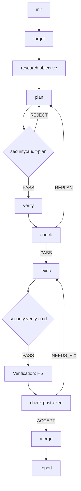
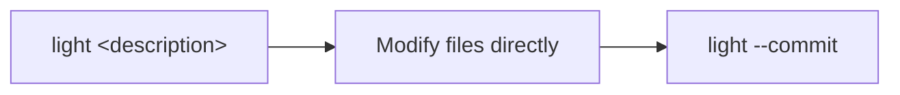

# Moonview

[中文文档](README_CN.md)

A plugin marketplace for structured task lifecycle management.

> *"Standing on the moon, looking at Earth"* — [老王来了@dlw2023](https://www.youtube.com/@dlw2023)

## Installation

Add the Moonview marketplace to your preferred agent:

```bash
# Gemini CLI
gemini plugin add huacheng/moonview

# Claude Code
claude plugin add huacheng/moonview

# Codex CLI
codex plugin add huacheng/moonview
```

## Plugins

### task-ai (v0.8.3)

## I. Overview

task-ai is a **pure Markdown instruction-driven** task lifecycle management framework. It runs as a model-agnostic plugin, managing the full lifecycle from task initialization to completion reports. The framework supports domain-adaptive verification (VFP protocol), cross-task knowledge reuse, and highly automated autonomous execution.

**Core philosophy**: "Task as Notebook". Every task is bound to an independent Notebook structure, ensuring clear responsibility boundaries and complete audit trails.

**Entry command**: `/task-ai:<subcommand> [args]`

---

## II. 18 Sub-commands

### Core Lifecycle (in typical order)

| Sub-command | Tier | Role | Notes |
|-------------|------|------|-------|
| `init` | light | Initialize working directory and git branch | Requires `<project> <notebook>` |
| `target` | light | **Define/review task objectives** | Bidirectional sync with `.target.md` |
| `research` | medium | Intelligence collection, type discovery | Independently callable at any phase |
| `plan` | heavy | Generate implementation plan `.plan.md` | Auto-generates VH verification stubs |
| `verify` | medium | Run domain-adapted tests (VH/CGG) | Produces test result files |
| `check` | heavy | Plan/execution review and gating | Three checkpoints control state transitions |
| `exec` | heavy | Step-by-step plan execution | Follows VFP protocol (Red → Green → Refactor) |
| `merge` | medium | Merge task branch, clean up metadata | Auto-deletes task branch |
| `report` | medium | Generate completion report, distill experience | Syncs knowledge to `.library` |

### Auxiliary & System Commands

| Sub-command | Tier | Role |
|-------------|------|------|
| `light` | light | **Inline fix**: directly modify and commit on current branch, no state changes. |
| `read` | medium | **System Immunity**: safely ingest knowledge from external docs/URLs into library. |
| `security` | heavy | **Security Gateway**: pre-audit plans and verify high-risk commands. |
| `auto` | heavy | Autonomous execution loop: single-session orchestration via `.auto-signal`. |
| `cancel` | light | Cancel task, clean up state. |
| `list` | light | Query task inventory, dependency graph, and task status. |
| `annotate` | medium | Process interactive annotations from the Plan panel. |
| `summarize` | light | Regenerate `.summary.md` for compressed context. |
| `library` | light | Knowledge library management (search, rebuild index, archive maintenance). |

### Simplified Arguments

Apart from `init` and `light` which require explicit project/task names at launch, all other commands auto-detect context via **path sniffing** and **git branch matching** — no manual arguments needed.

### Typical Sub-command Flow

#### 1. Standard Heavy Task


#### 2. Lightweight Inline Operation (Light Path)


#### 3. Auxiliary & Global Commands
- **`auto`**: Wraps the standard flow, auto-driven via `.auto-signal`.
- **`read`**: Globally callable, feeds knowledge into `.library`.
- **`list` / `summarize` / `library`**: Status and management tools, available anytime.

---

## III. State Machine (8 states, 20 transitions)

```
draft → planning → review → executing → complete
                 ↗            ↘
          re-planning    ←    blocked
```

### Key Design Constraints
1. **`light` is stateless**: `light` mode operates directly on the current branch and does not participate in state machine transitions.
2. **Security first**: All `exec` operations must pass `security` validation before execution.

---

## IV. VFP Protocol & Quality Assurance

### Verification-First Protocol (VFP)
The framework enforces a **Verification-First Protocol**:
- **VH (Verification Hypothesis)**: Define failure baselines during the planning phase.
- **HS (Hypothesis Satisfied)**: Verify success after implementation.
- **CGG (Cumulative Green Gate)**: Every modification must pass full regression.

### Automated Audit (Six-Perspective Audit)
The built-in `.dev/validate.sh` performs deep checks across six dimensions on all 18 skills:
1. **Structural consistency**: Step numbering, cross-references.
2. **Routing compliance**: `.auto-signal` state machine transitions.
3. **Technical integrity**: Locking mechanisms, data flow closure.
4. **Functional robustness**: Full TDD contract test coverage.
5. **Security defense**: 10 categories of injection sanitization, path traversal prevention.
6. **Protocol compliance**: Authoritative protocol section (`§`) references.

---

## V. Environment & Compatibility

### Model Agnostic
- Completely removed hard-coded references to specific LLM names.
- Uses the generic term `the agent` instead of any specific model name.
- Documentation fully standardized in English; prompts support multiple CLI environments (Gemini/Claude Code, etc.).

### Infrastructure
- **No inline Python**: All Bash scripts operate through standalone utility modules (`state.py`, `json_get.py`); embedding Python in shell is strictly prohibited.
- **Concurrency protection**: Atomic locking mechanism based on `flock`, ensuring state safety during multi-task parallel execution.

### Environment Variables

| Variable | Default | Description |
|----------|---------|-------------|
| `NB_WORKSPACES_ROOT` | `/home/user/nb-workspaces` | Root directory for all projects and notebooks |
| `NB_WORKSPACES_LIBRARY` | `$NB_WORKSPACES_ROOT/.library` | Shared knowledge library directory |

---

## VI. Current Statistics

| Metric | Value | Notes |
|--------|-------|-------|
| Total sub-commands | 18 | Full coverage from research to delivery |
| Contract tests passed | **713 PASS** | 0 FAIL, 0 ERROR |
| State machine states | 8 | `light` has no state transitions |
| Documentation coverage | 100% | Every skill has a complete SKILL.md |

---

## Quick Start

```bash
# 1. Initialize a notebook under a project
/task-ai:init my-project auth-refactor --title "Refactor auth to JWT"

# 2. Write requirements in .target.md, then let research deepen them
/task-ai:research my-project/auth-refactor --caller target

# 3. Generate plan
/task-ai:plan auth-refactor --generate

# 4. Verify → check plan quality
/task-ai:verify auth-refactor
/task-ai:check auth-refactor --checkpoint post-plan

# 5. Execute the plan
/task-ai:exec auth-refactor

# 6. Merge to main + generate report
/task-ai:merge auth-refactor
/task-ai:report auth-refactor

# Or run the full lifecycle automatically:
/task-ai:auto auth-refactor --start
```

---
*Summary auto-generated and verified by task-ai (v0.8.3).*

## Related

- [ai-cli-online](https://github.com/huacheng/ai-cli-online) — Web interface with Plan annotation panel and Chat editor

## License

MIT
