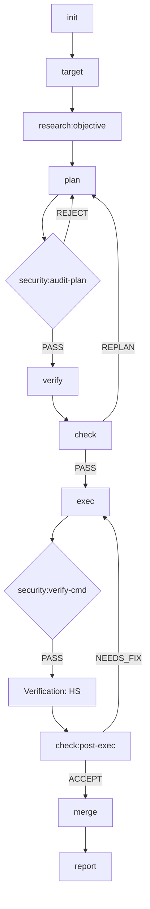
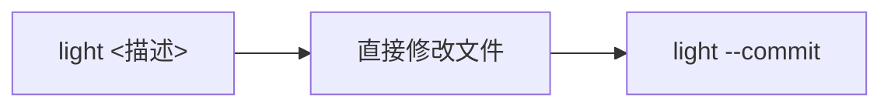

# Moonview

[English](README.md)

一个通用的插件市场，提供结构化的任务生命周期管理。

> *"站在月球看地球"* — [老王来了@dlw2023](https://www.youtube.com/@dlw2023)

## 安装

将 Moonview 插件市场添加到您首选的智能体中：

```bash
# Gemini CLI
gemini plugin add huacheng/moonview

# Claude Code
claude plugin add huacheng/moonview

# Codex CLI
codex plugin add huacheng/moonview
```

## 插件

### task-ai (v0.8.3)
## 一、概述

task-ai 是一套**纯 Markdown 指令驱动**的任务生命周期管理框架。它作为一个通用的、模型解耦的插件运行，管理从任务初始化到完成报告的完整生命周期。框架支持领域自适应验证（VFP 协议）、跨任务知识复用和高度自动化的自主执行。

**核心哲学**: “任务即 Notebook”。所有任务都绑定到独立的 Notebook 结构中，确保责任边界清晰和审计追踪完整。

**入口命令**: 在 Prompt 窗口输入 `/moonview:<subcommand> [args]`

---

## 二、18 个子命令

### 核心生命周期（按典型顺序）

| 子命令 | 模型层级 | 职责 | 备注 |
|--------|---------|------|------|
| `init` | light | 初始化工作目录、Git 分支 | 需提供 `<project> <notebook>` |
| `target` | light | **定义/评审任务目标** | 双向同步 `.target.md` |
| `research` | medium | 情报收集、类型发现 | 任意阶段可独立调用 |
| `plan` | heavy | 生成实施计划 `.plan.md` | 自动生成 VH 验证存根 |
| `verify` | medium | 运行领域适配测试 (VH/CGG) | 生成测试结果文件 |
| `check` | heavy | 计划/执行评审与门禁 | 三大检查点控制状态流转 |
| `exec` | heavy | 按计划逐步执行实施 | 遵循 VFP 协议（红→绿→重构） |
| `merge` | medium | 合并任务分支，清理元数据 | 自动删除任务分支 |
| `report` | medium | 生成完成报告，经验蒸馏 | 将知识同步至 `.library` |

### 辅助与系统命令

| 子命令 | 模型层级 | 职责 |
|--------|---------|------|
| `light` | light | **轻量内联操作**：在当前分支直接修改并提交，无状态变更。 |
| `read` | medium | **系统免疫**：从外部文档/URL 安全吸纳知识到图书馆。 |
| `security` | heavy | **安全网关**：前置审计计划和验证高危命令。 |
| `auto` | heavy | 自主执行循环：单会话编排，通过 `.auto-signal` 驱动。 |
| `cancel` | light | 取消任务，清理状态。 |
| `list` | light | 查询任务清单、依赖图及影子任务状态。 |
| `annotate` | medium | 处理实施计划面板的交互批注。 |
| `summarize` | light | 重新生成 `.summary.md` 压缩上下文。 |
| `library` | light | 知识库管理（搜索、索引重建、归档维护）。 |

### 参数简化方案 (Hard Upgrade)
除了 `init` 和 `light` 启动阶段需要指定项目/任务名外，其他所有命令均通过**路径嗅探**和**Git 分支匹配**自动锁定上下文，无需手动输入参数。

### 典型子命令流转图

#### 1. 标准重型任务 (Standard Path)


#### 2. 轻量内联操作 (Light Path)


#### 3. 辅助与全局命令 (Auxiliary)
- **`auto`**: 封装标准流，通过 `.auto-signal` 自动驱动。
- **`read`**: 全局调用，向 `.library` 输送知识。
- **`list` / `summarize` / `library`**: 随时调用的状态与管理工具。

---

## 三、状态机 (8 状态 20 转换)

### 关键设计约束
1. **`light` 无状态**：`light` 模式在当前分支直接操作，不参与状态机转换。
2. **安全前置**: 所有 `exec` 执行前必须通过 `security` 校验。

---

## 四、VFP 协议与质量保证

### 验证先行协议 (VFP)
框架强制执行 **Verification-First Protocol**：
- **VH (Verification Hypothesis)**: 计划阶段定义失败基线。
- **HS (Hypothesis Satisfied)**: 实施后验证成功。
- **CGG (Cumulative Green Gate)**: 每次修改必须通过全量回归。

### 自动化审计 (Six-Perspective Audit)
框架内置 `.dev/validate.sh` 对 18 个 Skill 执行六个维度的深度检查：
1. **结构一致性**: 步骤编号、交叉引用。
2. **路由合规**: `.auto-signal` 状态机跳转。
3. **技术完整性**: 锁定机制、数据流闭环。
4. **功能健壮性**: TDD 契约测试全覆盖。
5. **安全防护**: 10 类注入解毒、路径穿越防御。
6. **协议合规**: 权威协议节 (`§`) 引用。

---

## 五、环境与兼容性

### 模型解耦 (Agnostic)
- 彻底移除对特定大模型名称的硬编码。
- 采用通用术语 `the agent` 代替旧有的 `Claude`。
- 文档全面英文规范化，Prompt 支持多 CLI 环境（Gemini/Claude Code 等）。

### 基础设施
- **去 Python 内联**: 所有 Bash 脚本均通过独立工具类（`state.py`, `json_get.py`）操作数据，严禁 Shell 中嵌入 Python 代码。
- **并发保护**: 基于 `flock` 的原子锁机制，确保多任务并行时的状态安全。

---

## 六、当前统计

| 指标 | 数值 | 备注 |
|------|------|------|
| 子命令总数 | 18 | 覆盖从调研到交付全流程 |
| 契约测试通过数 | **617 PASS** | 0 FAIL, 0 ERROR |
| 状态机状态数 | 8 | light 无状态转换 |
| 文档覆盖度 | 100% | 每个 Skill 均有完整 SKILL.md |

---
*总结由 task-ai (v0.8.3) 自动生成并验证。*

## 相关项目

- [ai-cli-online](https://github.com/huacheng/ai-cli-online) — 网页界面，包含 Plan 批注面板和 Chat 编辑器

## 许可证

MIT
