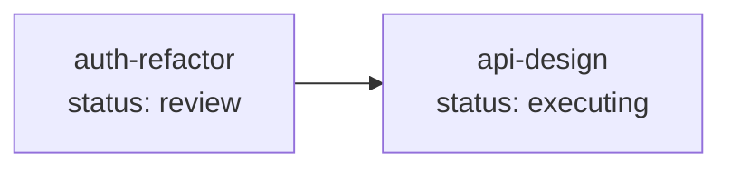

# /task-ai:list — Read-Only Task Query

Query task status, details, and relationships. Pure read-only — no files written, no status changes, no git commits.

## Usage

```
/task-ai:list                           # List all tasks
/task-ai:list <notebook_name>             # Single notebook details
/task-ai:list --deps                      # Dependency graph (all notebooks)
/task-ai:list --timeline <notebook_name>  # Status transition timeline
```

## Modes

### 1. List All Notebooks (no arguments)

Output a summary table of all notebooks:

| Column | Source |
|--------|--------|
| Notebook | directory name |
| Title | `.index.json` → `title` |
| Status | `.index.json` → `status` |
| Phase | `.index.json` → `phase` (if non-empty) |
| Progress | `.index.json` → `completed_steps` |
| Type | `.index.json` → `type` |
| Updated | `.index.json` → `updated` |

### 2. Single Notebook Details (`<notebook_name>`)

Output all fields from `<notebook_name>/.working/.index.json` plus:
- `.summary.md` content (if exists) — condensed context
- `.target.md` first 10 lines — requirements preview
- File listing of task module directory

### 3. Dependency Graph (`--deps`)

Generate a Mermaid diagram showing all task modules and their `depends_on` relationships:



Nodes colored by status: green (complete), blue (executing/review), yellow (planning/re-planning), red (blocked), gray (draft/cancelled).

### 4. Status Timeline (`--timeline <notebook_name>`)

Extract status transition history from git log:

```
git log --oneline --fixed-strings --grep="task-ai(<notebook>)"
```

Use `--fixed-strings` to prevent `(` and `)` in the pattern from being interpreted as regex metacharacters.

Parse commit messages to reconstruct the timeline of status changes with timestamps.

## Execution Steps

1. **Scan** `$NB_WORKSPACES_ROOT/` — list project directories, then within each project list notebook directories that contain `.working/.index.json` to discover notebooks
2. **Metadata extraction**: For each discovered notebook, read `.working/.index.json` to extract `title`, `status`, `type`, and `branch`.
3. **If `--deps`**: build dependency graph from all notebooks' `depends_on` fields; **if `--timeline`**: extract history via `git log --oneline --grep="task-ai(<notebook>)"`
4. **Display**: Format and print output (table, details, Mermaid graph, or timeline)

## State Transitions

| Current Status | After List | Condition |
|----------------|------------|-----------|
| Any | (unchanged) | Read-only query |

## Git

None — `list` does not create any commits (e.g., it will never create a `task-ai(<notebook>):feat ...` commit).

## .auto-signal

None — `list` does not write `.auto-signal`. It is a utility command that does not participate in the automation loop.

## Notes

- **Pure read-only**: `list` never writes files, never changes status, never creates commits. It is safe to run at any time without side effects
- **No lock required**: Since `list` only reads files, it does not acquire `.working/.lock`
- **Dependency validation**: The `--deps` mode only visualizes relationships; it does not validate whether dependencies are met (that is `check`'s responsibility)
