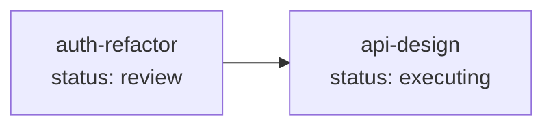

# /task-ai:list — Read-Only Task Query

Query task status, details, and relationships. Pure read-only — no files written, no status changes, no git commits.

## Usage

```
/task-ai:list                  # List all tasks
/task-ai:list --deps           # Dependency graph (all notebooks)
/task-ai:list --timeline       # Status transition timeline (notebook auto-detected)
```

**Notebook auto-detection:** When in a notebook directory, details for that notebook are shown automatically. The notebook is resolved from CWD (`.working/.status.json`) or the current git branch (`task/<notebook>`).

## Modes

### 1. List All Notebooks (no arguments)

Output a summary table of all notebooks:

| Column | Source |
|--------|--------|
| Notebook | directory name |
| Title | `.status.json` → `title` |
| Status | `.status.json` → `status` |
| Phase | `.status.json` → `phase` (if non-empty) |
| Progress | `.status.json` → `completed_steps` (integer — steps completed so far) |
| Type | `.status.json` → `type` |
| Updated | `.status.json` → `updated` |

### 2. Single Notebook Details (auto-detected from CWD or task branch)

When invoked inside a notebook directory (CWD contains `.working/.status.json`) or on a task branch (`task/<notebook>`), outputs all fields from the notebook's `.working/.status.json` plus:
- `.summary.md` content (if exists) — condensed context
- `.target.md` first 10 lines (preview, if exists) — requirements overview
- File listing of `.working/` directory (system files and sub-directories)

### 3. Dependency Graph (`--deps`)

Generate a Mermaid diagram showing all task modules and their `depends_on` relationships:



Arrow direction: `A --> B` means "A depends on B" (drawn from the `depends_on` field of A). Nodes colored by status: green (satisfied), cyan (evolving), blue (executing/review), yellow (planning/re-planning), red (blocked), gray (draft/cancelled).

### 4. Status Timeline (`--timeline`, notebook auto-detected)

Extract status transition history from git log:

```
git log --format="%h %ai %s" --fixed-strings --grep="task-ai(<notebook>)" -n 100
```

The format `%h %ai %s` includes abbreviated hash, author date (ISO format), and subject — providing the timestamps needed for timeline reconstruction. The `--fixed-strings` flag prevents `(` and `)` in the pattern from being interpreted as regex metacharacters. The `-n 100` limit bounds output size; most tasks have far fewer transitions.

Parse commit messages to reconstruct the timeline of status changes.

## Execution Steps

1. **Scan** `$NB_WORKSPACES_ROOT/` — list project directories (depth 1), then within each project list notebook directories (depth 1) that contain `.working/.status.json`. Max scan depth is 3 levels from `$NB_WORKSPACES_ROOT`: project / notebook / `.working/`
2. **Metadata extraction**: For each discovered notebook, read `.working/.status.json`. For list-all mode, extract `title`, `status`, `phase`, `completed_steps`, `type`, and `updated`. For single-notebook mode, read all fields (full JSON output)
3. **If `--deps`**: build dependency graph from all notebooks' `depends_on` fields; **if `--timeline`**: auto-detect notebook from CWD or task branch (REJECT if not in a notebook context — timeline requires a specific notebook), then extract history via `git log --format="%h %ai %s" --fixed-strings --grep="task-ai(<notebook>)" -n 100`
4. **Display**: Format and print output (table, details, Mermaid graph, or timeline)

## State Transitions

| Current Status | After List | Condition |
|----------------|------------|-----------|
| Any | (unchanged) | Read-only query |

## Git

None — `list` does not create any commits.

## .auto-signal

None — `list` does not write `.auto-signal`. It is a utility command that does not participate in the automation loop.

## Notes

- **Pure read-only**: `list` never writes files, never changes status, never creates commits. It is safe to run at any time without side effects
- **No lock required**: Since `list` only reads files, it does not acquire `.working/.lock`
- **Corrupt/missing .status.json**: If a notebook's `.status.json` is missing or fails to parse, skip that notebook with a warning line in the output (do not abort the entire listing)
- **Dependency validation**: The `--deps` mode only visualizes relationships; it does not validate whether dependencies are met (that is `check`'s responsibility)
- **Mutually exclusive modes**: `--deps` and `--timeline` cannot be combined. If both are provided, reject with usage hint
